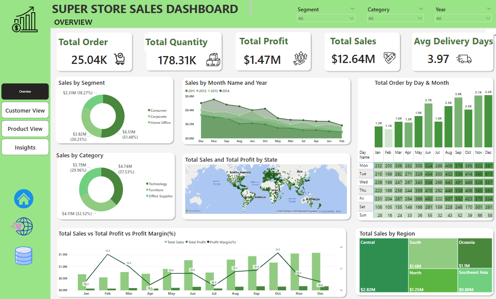
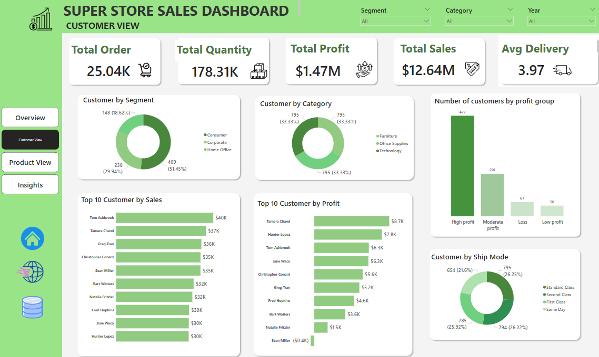
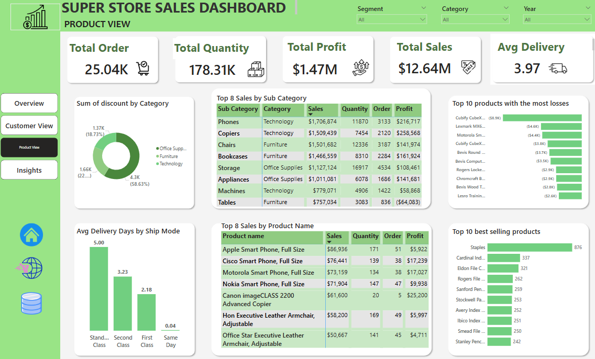
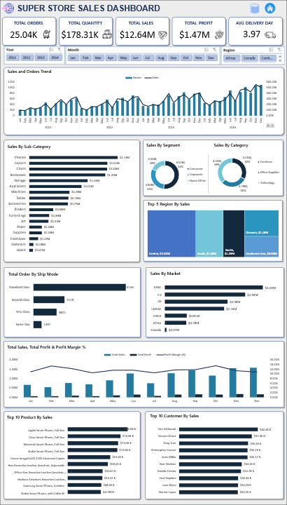

# 🛒 Superstore Data Analysis Project

## 📌 Project Overview

This project focuses on analyzing Superstore sales data using **Python**, **SQL**, and **Power BI**. The objectives include identifying key sales trends, segmenting customers, predicting potential profit/loss orders, and building interactive dashboards for business insights.

---

## 🎯 Objectives

- Understand customer behavior and product performance
- Clean and preprocess raw data
- Explore trends in sales, profit, shipping, etc.
- Cluster customers for targeted strategies
- Predict profit/loss in orders
- Build dashboards for business reporting

---

## 🧰 Tools & Technologies

- **Python** (`pandas`, `numpy`, `matplotlib`, `seaborn`, `scikit-learn`)
- **SQL** (PostgreSQL)
- **Power BI** (Interactive dashboards)

---

## 🧪 Python Analysis Steps

### 🔹 1. Load and Prepare the Data

- Loaded the dataset from `superstore_sales.csv` using pandas.

- Cleaned numerical columns such as `Sales`, `Profit`, and `Shipping Cost` by removing commas and converting to float.

- Exported the cleaned data to `superstore_sales_clean.csv` for further use.

- Verified the dataset structure: 21 columns, 51,290 rows, including numerical features (`Sales`, `Profit`, `Quantity`) and categorical features (`Customer Name`, `Category`, etc.).
### 🔹 2. Data Cleaning

- Classified columns into numerical (e.g., `Sales`, `Profit`, `Quantity`) and categorical (e.g., `Order ID`, `Ship Mode`, `Category`).

- Ensured no missing values remained.

- Finalized data structure for deeper analysis.

### 🔹 3. Exploratory Data Analysis (EDA) & Visualization
- Used **Matplotlib**, **Seaborn**, and **Numpy** for data visualization.

- Created visualizations for:

    - Revenue trends over time

    - Profit distribution

    - Correlation between discount, sales, and profit

    - Customer behavior and segment performance

    - Geographic and temporal insights

### 🔹 4. Customer Clustering
- Applied **KMeans clustering** and **PCA** for dimensionality reduction.

- Clustered customers based on key numerical features (e.g., `Total Sales`, `Order Frequency`, `Profit`).

- Scaled features using `StandardScale` to optimize clustering performance.

- Identified potential high-value and low-value customer segments.

### 🔹 5. Prediction and Modeling
- Built regression models to predict profit:

    - `LinearRegression`

    - `RandomForestRegressor`

    - `XGBRegressor`

- Built classification models to predict whether an order would result in profit or loss:

    - `LogisticRegression`

    - `DecisionTreeClassifier`
- Evaluated models using:

    - Regression Metrics: `MAE, MSE, R²`

    - Classification Metrics: `Confusion Matrix`, `Accuracy`, `Precision`, `Recall`, `F1 Score`

---

## 💻 SQL Queries Steps

### 🗃️ 1. Data Structure and Management
Creates roles and a database with a designed schema, including `orders` and `returns` tables, followed by importing data from CSV files for analysis readiness.

### 💰 2. Revenue and Profit Overview
Calculates total revenue and profit, analyzes trends by year, quarter, and region, determines profit margins, lists top loss-making orders, and evaluates the loss order rate.

### 👥 3. Customer Analysis
Assesses total customers, orders, and average value, identifies top customers by revenue, profit, and order count, segments by profit levels, calculates RFM, and measures retention rate.

### 📦 4. Product and Category Analysis
Lists categories and products, identifies top products by sales volume, revenue, profit, and loss-making items, analyzes performance by category/sub-category, and examines the relationship between sales volume and profit.

### 🚚 5. Shipping Analysis
Computes average delivery time, compares costs and profits by shipping mode, identifies orders with high shipping costs but low profits, and analyzes the loss order rate by shipping method.

### 📈 6. Trend and Time Analysis
Evaluates sales performance by year, analyzes monthly revenue, identifies the top revenue-generating months, and calculates year-over-year revenue growth.

### 🗺️ 7. Region, Market, and State Analysis
Determines regions and states with the highest revenue and profit, analyzes performance by market and state, lists states with negative profits, and identifies top-selling products by region.

### 🧠 Conclusion

- SQL comprehensively leverages Superstore Sales data, providing actionable insights to optimize revenue, reduce losses, and enhance customer, product, and logistics strategies.
---

## 📊 Power BI Dashboard

### 1️⃣ Overview

### 2️⃣ Customer

### 3️⃣ Product

---
## 📈 Excel Dashboard

### 1️⃣ Sales Dashboard

**Key Features:**
- Interactive dashboard using Pivot Tables, Pivot Charts, and Slicers.
- KPI cards for Total Orders, Quantity, Sales, Profit, and Average Delivery Days.
- Sales & Orders trend analysis by month.
- Sales breakdown by Category, Segment, Region, Market, and Ship Mode.
- Top-performing Products and Customers analysis.
- Profit Margin tracking and sales performance monitoring.

**Tools Used:**
- Microsoft Excel
- Pivot Table
- Pivot Chart
- Slicer
- Conditional Formatting
- Custom Number Formatting

## ✅ Key Takeaways
The super store dataset, covering a period of `48` month, records a total of `51,290` unique orders.

- **Business Performance Overview**

The total number of orders is `25,040`, indicating a large-scale retail operation with wide market coverage.
A total of `178,310` units were sold, averaging approximately `7` items per order, reflecting customers' diverse purchasing behavior.
Total sales reached `$12.64 million`, while total profit was only `$1.47 million`, resulting in an average profit margin of around `11.63%`. This relatively low margin highlights the need to optimize cost structures, discounts, and operational expenses.
The average delivery time is `3.97 days`, demonstrating an efficient logistics system with room for further improvement to boost customer satisfaction.

- **Segment & Category Performance**

The Home Office segment accounts for `51.48%` of total sales, making it the most profitable customer group. Marketing and retention strategies should focus heavily on this segment.
The Corporate and Consumer segments contribute `30.25%` and `18.27%` respectively, suggesting opportunities for targeted growth in these segments.
In terms of product categories, Furniture leads with `37.53%` of total revenue, followed by Office Supplies `(32.52%)` and Technology `(29.96%)`. Prioritizing inventory and promotions for Furniture can drive more revenue.

- **Time-Based Analysis**

Sales peak between `August` and `December`, with `November` and `December` being the most profitable months—likely due to seasonal campaigns such as Black Friday.
Conversely, `February` and `March` experience the lowest sales, indicating the need for strategic promotional efforts during low-demand periods.
`Mondays` and `Fridays` are the days with the highest number of orders, suggesting opportunities to launch day-specific promotions to maximize revenue.

- **Top Customers & Products**

`Tom Ashbrook` is the highest spender ($40K in sales), but not the most profitable. This demonstrates the importance of evaluating customers based on profitability rather than just sales volume.
`Tamara Chand`is the most profitable customer, generating $8.7K in profit, and should be prioritized in loyalty and engagement programs.
Products such as `Phones, Copiers, and Chairs` are top performers in both sales and profit, making them ideal for inventory prioritization and bundling strategies.
On the other hand, products like `Cubify CubeX, Lexmark MX611, and Bevis Round Table` incurred heavy losses, signaling the need to review pricing or discontinue underperforming items.

- **Summary & Recommendations**

Focus sales and customer retention strategies on the `Home Office` segment and `Central` region, which yield the highest performance.
Reassess discount policies for `Technology` products to ensure sustainable profit margins.
Identify and reduce focus on unprofitable products or customers, shift resources to high-margin and high-performing segments.
Use seasonal sales trends (`Nov–Dec`) and high-order weekdays (`Mon, Fri`) to strategically time marketing and promotional campaigns.
Optimize shipping options by balancing speed and cost to enhance customer experience without hurting profitability.
